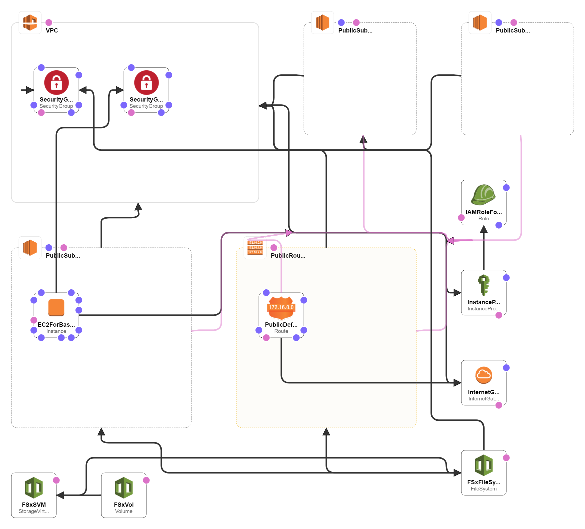

# deploy-fsxn-sandbox
- This CloudFormation template deploys a FSx for ONTAP file system with a volume in ap-northeast-1.
## Resources
- **a new VPC** (10.0.0.0/16) in ap-northeast-1
- **3 public subnet** (10.0.1.0/24, 10.0.2.0/24, 10.0.3.0/24)
- **an Internet Gateway** attached a new VPC
- **a Route table**, whitch is associated with 3 public subnet and is added a route to a Internet Gateway as the default gateway.
- **a Security Group for the bastion host**, which allow the following ingresses:
  - from the CIDR IP range (specified by the parameter) to port 22
- **a Security Group for FSx for ONTAP**, which allow the following ingresses from the bastion host:
  - https://docs.aws.amazon.com/fsx/latest/ONTAPGuide/limit-access-security-groups.html
- **an EC2 instance** for the bastion host, whitch installed
  - unzip
  - jq
  - wget
  - helm
  - kubectl
  - eksctl
- **an FSx for ONTAP file system** with **an SVM** and **an volume**

## Parameters
- **Name prefix:**
  - String, whitch is used as prefixes for all resource names deployed by this CloudFormation template.
- **Allowed external access CIDR:**
  - CIDR IP range that is permitted to access the instances. We recommend
    that you set this value to a trusted IP range. (Default: 0.0.0.0/0)
- **AMI ID for the bastion host:**
  - AMI ID of an EC2 instance for the bastion host. (Default: the latest Amazon Linux 2 AMI)
- **SSH key pair name:**
  - Name of an existing key pair for the bastion host.
- **FSx for ONTAP password:**
  - fsxadmin and SVM administrator user's password.

## Prerequisites
- **SSH key pair**
  - You need to create a SSH key pair before creating this CloudFomation template.

## Architecture Diagram

