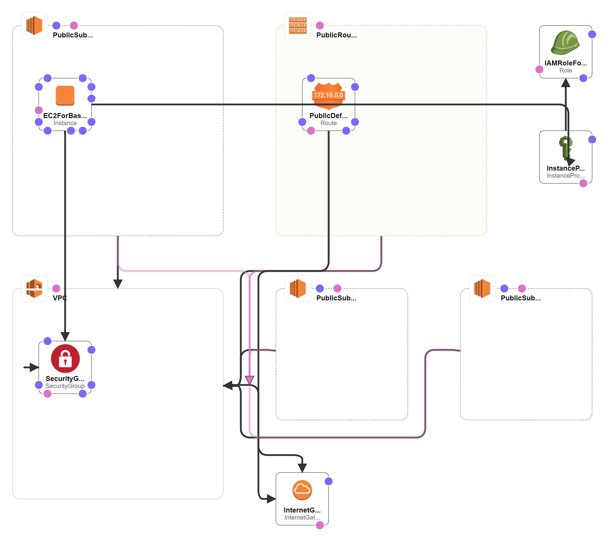

# deploy-vpc-and-bastion
- This CloudFormation template deploys a new VPC with 3 public subnets and a EC2 instance for the bastion host in ap-northeast-1.
## Resources
- **a new VPC** (10.0.0.0/16) in ap-northeast-1
- **3 public subnet** (10.0.1.0/24, 10.0.2.0/24, 10.0.3.0/24)
- **an internet gateway** attached a new VPC
- **a route table**, whitch is associated with 3 public subnet and is added a route to an internet gateway as the default gateway.
- **a security group for the bastion host**, which allow the following ingresses:
  - from the CIDR IP range (specified by the parameter) to port 22
- **an IAM role and an instance profile** for the bastion host
- **an Amazon EC2 instance for the bastion host**, whitch installed
  - unzip
  - jq
  - wget
  - helm
  - kubectl
  - eksctl

## Parameters
- **Name prefix:**
  - String, whitch is used as prefixes for all resource names deployed by this CloudFormation template.
- **Allowed external access CIDR:**
  - CIDR IP range that is permitted to access the bastion host. We recommend
    that you set this value to a trusted IP range. (Default: 0.0.0.0/0)
- **AMI ID for the bastion host:**
  - AMI ID of an Amazon EC2 instance for the bastion host. (Default: the latest Amazon Linux 2 AMI)
- **SSH key pair name:**
  - Name of an existing key pair for the bastion host.

## Prerequisites
- **SSH key pair:**
  - You need to create a SSH key pair before creating this CloudFomation template.

## Architecture Diagram

